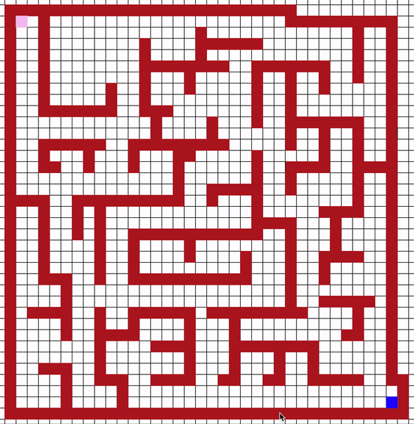
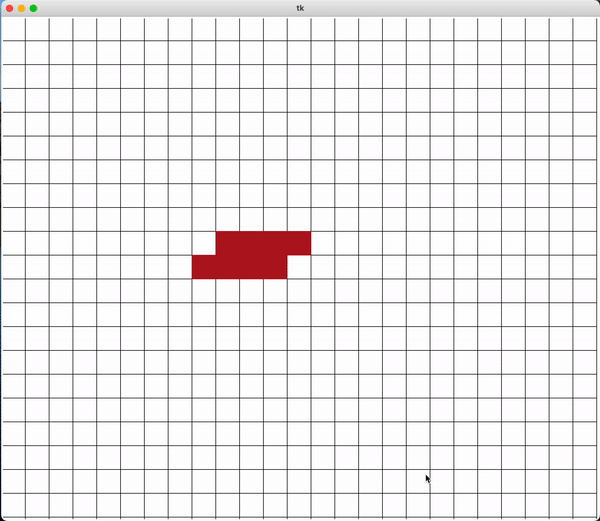

# Python-Grid-Sims
This repo is a collection of programs that run on a grid including Conway's game of life, Snake, and a Pathfinding visualization tool. 
Made by John Aldrete.
#### Breadth First Search

#### Conway's Game of Life


### How to use
Clone the git repo, and make sure you have tkinter installed.
Cd into the project folder and open app.py. You will see a block of code like this:
```python
  if __name__ == "__main__" :
    app = Tk()
    

    grid = Algos(app, 25, 25, 40)#What to change for differnt modes! 
    #Algos - Pathfinding, Conways - Conway's Game of Life, Snake - Snake
    #The parameters are the same for each class instance.

    grid.pack()


    app.mainloop()
```
Go ahead and run the following command and have fun! <br />
```
python3 app.py
```
Here is how to use each of the modules:  <br />
#### Algos
**Mouse 1** will place the walls in which the pathfinding will work around.<br />
**Shift Mouse 1** will place the starting point of the search algorithm.<br />
**Command Mouse 1** will place the ending point of the search algorithm.<br />
**b** perform breadth first search.<br />
**d** perform depth first search.<br />
**Shift Tab** clear screen of visited nodes and path, but leave starting points and walls.<br />
**c** clears the entire screen.<br />

#### Conways
**Mouse 1** will place alive cells. Make sure to place some before running.<br />
**r** will run Conway's game of life with the current cells on screen.<br />
**Spacebar** will pause the iterations of the game. If you want to add more cells this is the order of operations: pause the game (Space), add the cells (Mouse 1), unpause the game (Space), and finally run the game once again (r). <br />

#### Snake
**s** will start the Snake module. <br />
**Arrow Keys** will control the snakes movement. <br />

Made by [John Aldrete](https://www.linkedin.com/in/john-aldrete-73b373232/).
